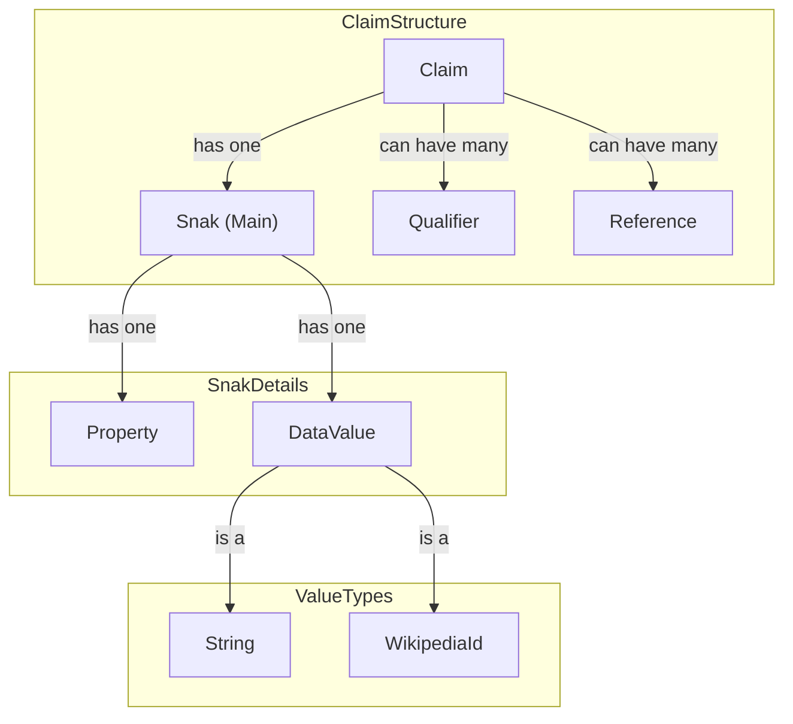
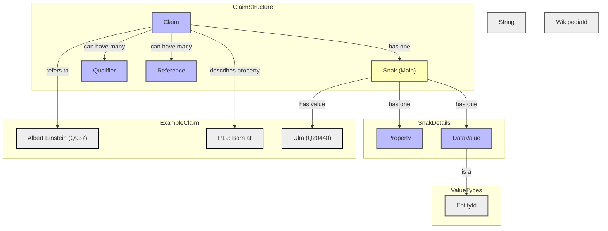

# Wikibase Console

Command line app for exploring the [Wikibase API](https://www.mediawiki.org/wiki/Wikibase/API).

Most of my repos are private but this one is in front of my [loyal followers](https://github.com/GaryB432?tab=followers) (you know who you are 😎).

# Goals

Be a repo that

- keeps me young and enthused
- uses modules (ESM)
- can be used to reproduce any dependency issues
- takes baby-steps with LLM and co-pilot (commit messages for now and just a bit of code generation which is documented)
- serves as dogfood and a laboratory for my other projects

  - [eslint-plugin-gb - npm](https://www.npmjs.com/package/eslint-plugin-gb)
  - [gb-schematics - npm](https://www.npmjs.com/package/gb-schematics)
  - [humanaccomplishment.com](https://www.humanaccomplishment.com)

- is a [playground](https://garyb432.github.io/wikibase-console/) for [GitHub Pages](https://pages.github.com/) (`gh-pages` branch) and [Jekyll](https://jekyllrb.com/) should I ever get to that.

# Non-Goals

- Duplicate functionality of official Wikibase tools
- Be a real tool that people will actually use

# Common development commands

- pnpm dlx prettier . -w
- pnpm exec eslint
- pnpm run build
- pnpm run lint
- pnpm run test
- tsx src/main.ts

# References

[maxlath/wikibase-sdk](https://github.com/maxlath/wikibase-sdk): JS utils functions to query a Wikibase instance and simplify its results

[Wikibase/API - MediaWiki](https://www.mediawiki.org/wiki/Wikibase/API)

[wikidata.org/w/api.php?action=wbgetentities&ids=Q33725&format=json&languages=en&props=info%7Clabels](https://www.wikidata.org/w/api.php?action=wbgetentities&ids=Q33725&format=json&languages=en&props=info%7Clabels)

[wikidata.org/w/api.php?action=wbgetentities&ids=Q125121451&format=json&languages=en&props=info%7Clabels](https://www.wikidata.org/w/api.php?action=wbgetentities&ids=Q125121451&format=json&languages=en&props=info%7Clabels)

# Wikidata and the Semantic Web

> Albert Einstein was born at Ulm

