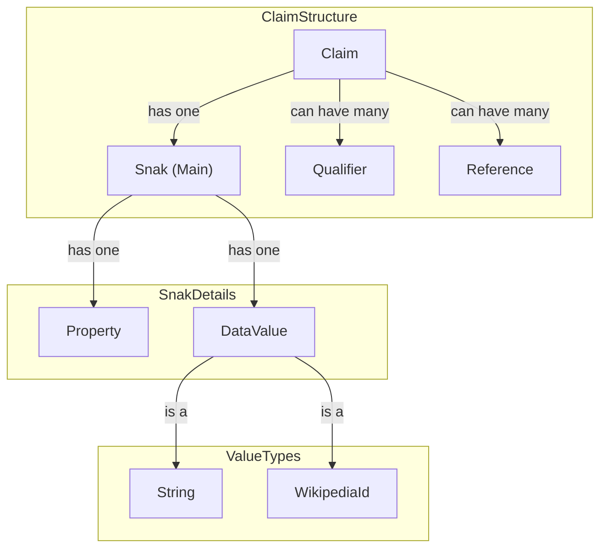
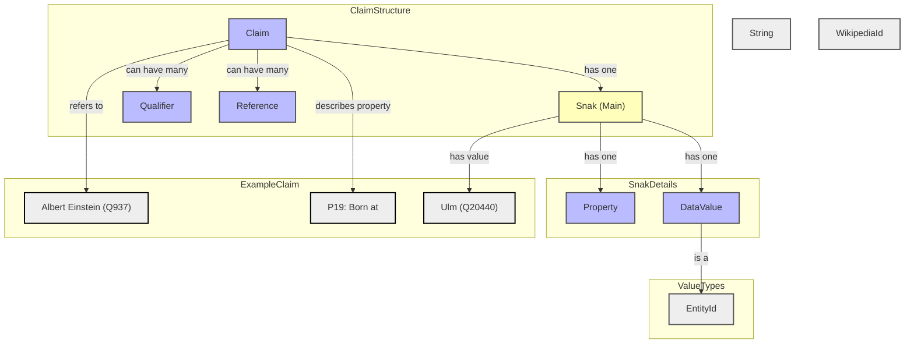

# Wikidata and the Semantic Web

```mermaid
graph TD
  subgraph ClaimStructure
    Claim -- has one --> MainSnak
    Claim -- can have many --> Qualifier
    Claim -- can have many --> Reference
    Claim[Claim]
    MainSnak["Snak (Main)"]
    Qualifier[Qualifier]
    Reference[Reference]
  end

  subgraph SnakDetails
    MainSnak -- has one --> Property
    MainSnak -- has one --> DataValue
    Property[Property]
  end

  subgraph ValueTypes
    DataValue[DataValue]
    DataValue -- is a --> String
    DataValue -- is a --> WikipediaId
    String[String]
    WikipediaId[WikipediaId]
  end

```

> Albert Einstein was born at Ulm

```mermaid
graph TD
  subgraph ClaimStructure
    Claim["Claim"]
    Claim -- has one --> MainSnak
    Claim -- can have many --> Qualifier
    Claim -- can have many --> Reference
  end

  subgraph SnakDetails
    MainSnak["Snak (Main)"]
    MainSnak -- has one --> Property
    MainSnak -- has one --> DataValue
    Property["Property"]
  end

  subgraph ValueTypes
    DataValue["DataValue"]
    DataValue -- is a --> EntityId
  end

  subgraph ExampleClaim
    Claim -- refers to --> EinsteinEntity
    Claim -- describes property --> BornAtProperty
    MainSnak -- has value --> UlmEntity
    EinsteinEntity["Albert Einstein (Q937)"]
    BornAtProperty["P19: Born at"]
    UlmEntity["Ulm (Q20440)"]
  end
  %%Styling
  style Claim fill:#bbf,stroke:#555,stroke-width:2px
  style MainSnak fill:#ffb,stroke:#555,stroke-width:2px
  style Property fill:#bbf,stroke:#555,stroke-width:2px
  style DataValue fill:#bbf,stroke:#555,stroke-width:2px
  style Qualifier fill:#bbf,stroke:#555,stroke-width:2px
  style Reference fill:#bbf,stroke:#555,stroke-width:2px
  style String fill:#eee,stroke:#555,stroke-width:2px
  style WikipediaId fill:#eee,stroke:#555,stroke-width:2px
  style EntityId fill:#eee,stroke:#555,stroke-width:2px
  style EinsteinEntity fill:#eee,stroke:#000,stroke-width:2px
  style BornAtProperty fill:#eee,stroke:#000,stroke-width:2px
  style UlmEntity fill:#eee,stroke:#000,stroke-width:2px

```
